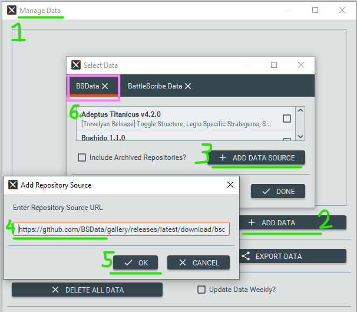
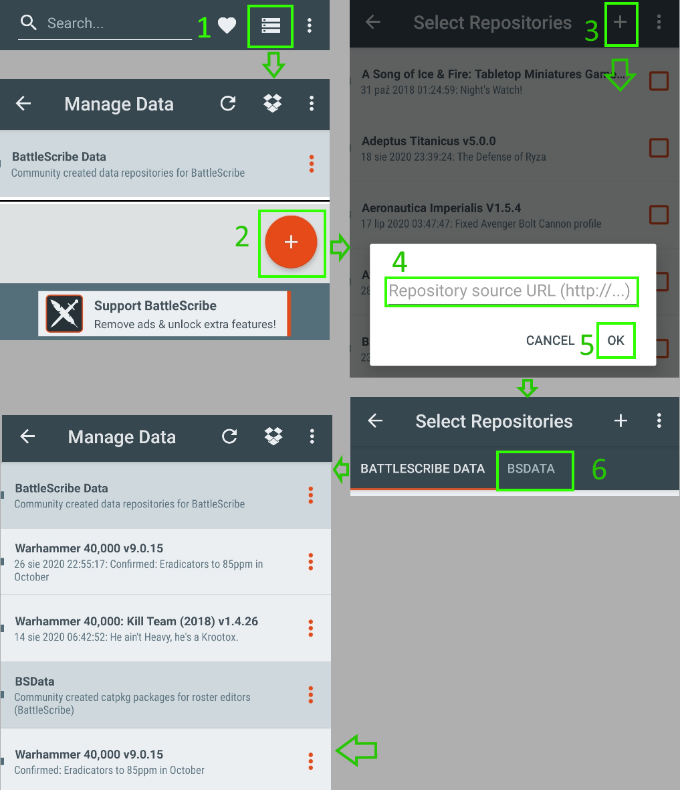

# gallery
Gallery to browse all BattleScribe data sources (repositories), track and index them automatically.

## Usage

To try out this new data distribution system, you need to copy the following URL:

> `https://github.com/BSData/gallery/releases/latest/download/bsdata.catpkg-gallery.json`

and paste it into an **Add repository source** field. Depending on your device:

- Desktop  

- Android  

