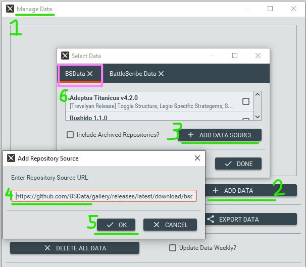
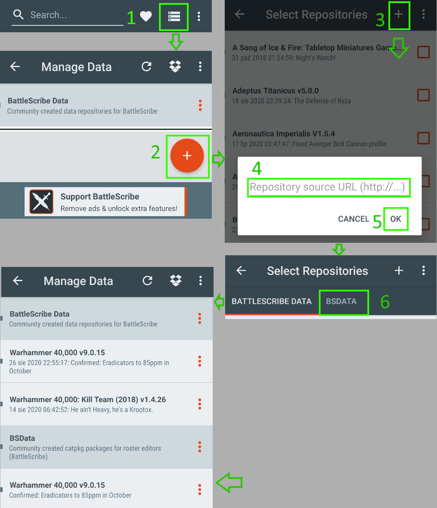

# gallery

Gallery to browse all BattleScribe data sources (repositories), track and index them automatically.

The gallery can be visually browsed at [gallery.bsdata.net](https://gallery.bsdata.net/).

## How It Works

This repository serves as a **registry** of BattleScribe data repositories. GitHub Actions workflows:

1. **Validate** new registry entries on pull requests
2. **Auto-discover** repositories in the [BSData](https://github.com/BSData) organization with the `battlescribe-data` topic
3. **Compile an index** of all repositories' latest releases into a gallery JSON file
4. **Publish** the gallery JSON as a [GitHub release asset](https://github.com/BSData/gallery/releases/latest/download/bsdata.catpkg-gallery.json)

## Usage

### BattleScribe

This distribution channel works on BattleScribe for PCs and Android, but not iOS.

To try out this new data distribution system with BattleScribe, you need to copy the following URL:

> `https://github.com/BSData/gallery/releases/latest/download/bsdata.catpkg-gallery.json`

and paste it into an **Add repository source** field. Depending on your device:

- Desktop
  
  

- Android
  
  

## Adding a New Repository

To add a new data repository to this distribution system:

1. Set up your repository as instructed in the [hosting guide](https://github.com/BSData/catalogue-development/wiki/Help:-Hosting-repositories)
2. Add a new file in [`registry/entries/`](https://github.com/BSData/gallery/tree/main/registry/entries)
3. Open a pull request

For example, for a repository like `https://github.com/BSData/skw9k`, create a file `skw9k.catpkg.yml` with:

```yaml
location:
  github: BSData/skw9k
```

See [CONTRIBUTING.md](CONTRIBUTING.md) for detailed instructions.

## Repository Structure

```
registry/
  settings.yml          # Gallery metadata and URLs
  entries/              # One .catpkg.yml per tracked repository
.github/
  workflows/            # CI, index update, registry update, ChatOps
  scripts/              # PowerShell scripts for index compilation
    lib/BsdataGallery/  # PowerShell module for gallery operations
  actions/              # Composite actions (install-yaml)
```

## License

[MIT](LICENSE)
