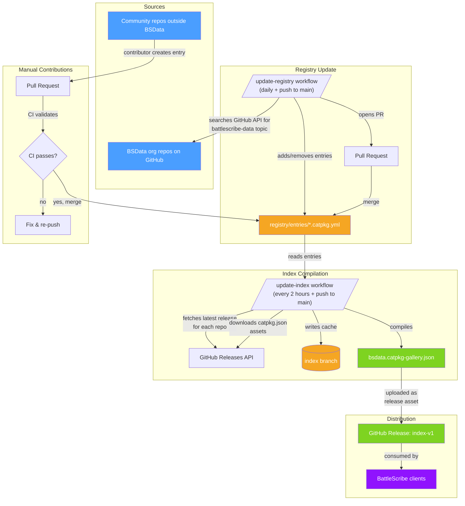

# Architecture

This document describes how the BSData Gallery workflows operate and how data flows through the system.

## Overview

The gallery is a **registry + index** system. Contributors register BattleScribe data repositories by adding YAML entries. Automated workflows then discover, validate, index, and publish a gallery JSON file that BattleScribe clients consume.

## Data Flow

## Workflows

### CI (`ci.yml`)

**Purpose**: Validates registry entries on PRs and pushes.

**Triggers**:
- Every push (except to `index` branch)
- Every pull request

**Steps**:
1. On PRs, determines which files changed vs the base branch
2. Runs `Validate-Registry.ps1` on changed entries (or all entries on push)

**Validation checks**:
- Entry has a `location.github` property
- Repository name is formatted as `owner/repo`
- Repository exists and is accessible (not private/deleted)
- Repository has the `battlescribe-data` topic (warning if missing)
- Repository has `publish-catpkg.yml` workflow (warning if missing)

### Update Registry (`update-registry.yml`)

**Purpose**: Auto-discovers and registers BSData org repositories.

**Triggers**:
- Daily at 09:00 UTC
- Push to `main` when workflow/script files change

**Steps**:
1. Searches GitHub API for repositories in the `BSData` org with the `battlescribe-data` topic
2. Adds `.catpkg.yml` entries for newly discovered repos
3. Removes entries for repos that no longer exist or lost the topic
4. Opens a PR with the changes (via `peter-evans/create-pull-request`)

### Update Index (`update-index.yml`)

**Purpose**: Compiles the gallery JSON index from all registry entries.

**Triggers**:
- Every 2 hours (cron)
- Push to `main` when registry or script files change

**Steps**:
1. Checks out `main` branch (registry + scripts) and `index` branch (cached data)
2. For each registry entry, queries GitHub API for the latest release
   - Uses `If-Modified-Since` headers for efficient caching
   - Skips repos that haven't changed since last check
3. Downloads each repo's `.catpkg.json` release asset
4. Updates the index cache (YAML files on the `index` branch)
5. Compiles all index entries into `bsdata.catpkg-gallery.json`
6. Pushes updated cache to the `index` branch
7. Uploads the gallery JSON as a release asset on the `index-v1` tag

### ChatOps (`chatops.yml`)

**Purpose**: Enables slash commands in issues and PRs.

**Triggers**:
- Any issue comment starting with `/`

**Steps**:
1. Checks out the `BSData/chatops` repo for command configuration
2. Dispatches the command via `peter-evans/slash-command-dispatch`

Example: `/template-workflows-pr BSData/some-repo` can set up CI workflows for a repository.

## Branches

| Branch | Purpose |
|--------|---------|
| `main` | Registry entries, scripts, workflows, documentation |
| `index` | Cached index data (one `.catpkg.yml` per repo with release info) |
| `gh-pages` | *(unused)* Previously hosted data for the gallery website |

## Key Files

| Path | Description |
|------|-------------|
| `registry/settings.yml` | Gallery metadata, URLs, and configuration |
| `registry/entries/*.catpkg.yml` | One file per registered repository |
| `.github/scripts/Validate-Registry.ps1` | Validates entries against GitHub API |
| `.github/scripts/Update-Registry.ps1` | Auto-discovers repos in BSData org |
| `.github/scripts/Update-IndexCache.ps1` | Orchestrates index compilation |
| `.github/scripts/lib/BsdataGallery/` | PowerShell module with core logic |
| `.github/actions/install-yaml/` | Composite action to install `powershell-yaml` |
